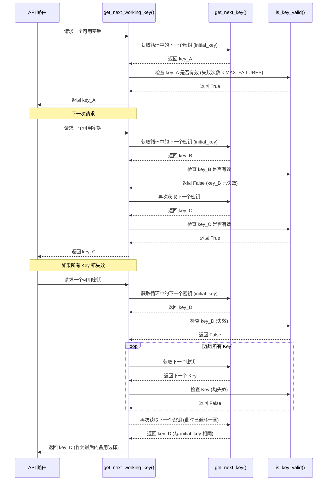

# Gemini Balance 项目分析文档

## 1. 项目概述

**Gemini Balance** 是一个基于 Python FastAPI 构建的、功能强大的 Google Gemini API 代理和负载均衡器。它旨在为开发者提供一个稳定、高效、可观测且易于管理的多模型、多密钥的 AI 网关服务。

### 核心功能点

*   **多 Key 负载均衡**: 自动轮询多个 Gemini API Key，提高可用性和并发能力。
*   **双协议 API 兼容**: 同时支持原生 Gemini API 和 OpenAI API 格式的请求，无缝对接现有生态。
*   **动态可视化配置**: 通过 Web UI 修改配置，无需重启服务即可生效。
*   **全面的可观测性**: 提供实时 Key 状态监控、API 调用统计和详细的错误日志查询。
*   **丰富的 AI 功能代理**: 不仅支持文本聊天，还集成了图文对话、联网搜索、图像生成、TTS 和 Embeddings 等多种功能。
*   **自动化运维**: 内置定时任务，可自动检查并恢复失效的 Key，以及定期清理旧日志和文件。
*   **健壮的设计**: 包含了完善的失败重试、自动禁用/恢复密钥、安全认证和错误处理机制。

### 技术栈

*   **后端**: Python 3.9+, FastAPI, Uvicorn
*   **数据库**: SQLAlchemy, MySQL / SQLite (支持异步)
*   **HTTP 客户端**: HTTPX (支持异步和代理)
*   **定时任务**: APScheduler
*   **前端**: Jinja2, Vanilla JavaScript, Tailwind CSS, Font Awesome

## 2. 系统架构图

```mermaid
graph TD
    subgraph "用户/客户端"
        A[第三方应用] -->|OpenAI API 格式| B
        C[开发者] -->|Gemini API 格式| B
        D[管理员] -->|Web UI| E[FastAPI 应用]
    end

    subgraph "Gemini Balance 核心服务"
        B(API 流量) --> E
        E --> F[安全中间件/服务<br>(认证/鉴权)]
        F --> G[路由中心<br>(routes.py)]
        
        G -->|/gemini/*| H1[Gemini 路由]
        G -->|/openai/*, /hf/*| H2[OpenAI 兼容路由]
        G -->|/config, /keys, /logs| H3[Web 页面路由]
        G -->|/api/*| H4[内部 API 路由]

        H1 --> I1[Gemini Chat Service]
        H2 --> I2[OpenAI Chat Service]
        H3 --> J[Jinja2 模板渲染]
        H4 --> K[内部服务<br>(配置/密钥/日志)]

        I2 --> L[消息转换器<br>(OpenAI -> Gemini)]
        L --> I1
        I1 --> M[API Client<br>(HTTPX)]
        
        subgraph "核心管理器"
            N[密钥管理器<br>(KeyManager)]
            O[模型服务<br>(ModelService)]
        end

        I1 --> N
        M --> N

        M --> P[外部 AI 服务<br>(Google Gemini API)]
        
        subgraph "数据持久化"
            Q[数据库 (MySQL/SQLite)]
            R[数据库服务<br>(database/services.py)]
            Q <--> R
        end

        E -- 应用启动时 --> R
        K --> R
        I1 -- 记录日志 --> R
        
        subgraph "后台任务"
            S[定时任务调度器<br>(APScheduler)]
            S --> T{检查失效 Key}
            S --> U{清理旧日志}
            S --> V{清理过期文件}
            T --> I1
            U --> R
            V --> R
        end
        E -- 应用启动时 --> S
    end

    style A fill:#f9f,stroke:#333,stroke-width:2px
    style C fill:#f9f,stroke:#333,stroke-width:2px
    style D fill:#ccf,stroke:#333,stroke-width:2px
```

## 3. 核心流程分析

### 3.1. API 请求处理流程

1.  **入口**: 客户端（如第三方应用）向 `/openai/v1/chat/completions` 发送一个符合 OpenAI 格式的请求。
2.  **认证**: `SecurityService` (通过依赖注入) 验证请求头中的 `Authorization` 令牌。
3.  **路由**: 请求被 `openai_routes.py` 中的 `@router.post(...)` 装饰器捕获。
4.  **获取密钥**: 路由函数通过依赖注入调用 `get_next_working_key_wrapper`，该函数从 `KeyManager` 获取一个当前可用的 Gemini API Key。
5.  **服务处理**: 请求被传递给 `OpenAIChatService`。
6.  **格式转换**: 在 `OpenAIChatService` 内部，`OpenAIMessageConverter` 将 OpenAI 格式的 `messages` 数组转换为 Gemini 格式的 `contents` 和 `systemInstruction`。
7.  **Payload 构建**: 服务根据模型名称（如是否包含 `-search` 后缀）和配置，动态构建一个包含 `tools` (如 `googleSearch`) 和 `safetySettings` 的最终请求体 (Payload)。
8.  **API 调用**: `GeminiApiClient` (HTTPX) 带着可用的 API Key 和构建好的 Payload，向 Google Gemini 的官方 API 端点发送异步 HTTP 请求。
9.  **失败与重试**:
    *   如果请求失败（如网络错误、Key 失效），`RetryHandler` 装饰器会捕获异常。
    *   它调用 `KeyManager.handle_api_failure` 来增加该 Key 的失败计数。
    *   `KeyManager` 返回一个新的可用 Key。
    *   装饰器使用新 Key 重新执行 API 调用，最多重试 `MAX_RETRIES` 次。
10. **响应转换**: `GeminiApiClient` 收到 Gemini 的响应后，`OpenAIResponseHandler` 将其转换回 OpenAI 的格式。
11. **日志记录**: 在 API 调用结束后，`add_request_log` 和 `add_error_log` 会被调用，将本次请求的详细信息（使用的 Key、模型、延迟、成功状态、错误信息等）异步写入数据库的 `t_request_log` 或 `t_error_logs` 表。
12. **返回**: 最终格式化好的响应返回给客户端。

### 3.2. 动态配置生效流程

1.  **应用启动**: `main.py` 调用 `load_dotenv()` 加载 `.env` 文件，`config.py` 中的 `Settings` 类初始化，从环境变量中读取配置到内存。
2.  **数据库同步**: 在应用启动的事件处理中，`sync_initial_settings` 函数被调用。
3.  **加载与合并**: 该函数连接数据库，从 `t_settings` 表中读取所有配置项，并用这些值覆盖内存中的 `settings` 对象（数据库优先）。
4.  **回写**: 合并后的最终配置被序列化并写回 `t_settings` 表，确保数据库与内存状态一致。
5.  **管理员修改**: 管理员在 Web UI (`/config`) 上修改配置并点击“保存”。
6.  **API 调用**: 前端 JS (`config_editor.js`) 将整个表单的数据收集为 JSON，通过 `PUT` 请求发送到 `/api/config` 端点。
7.  **服务处理**: `config_routes.py` 接收到请求，`ConfigService` 遍历 JSON 中的每一个键值对，并调用 `update_setting` 数据库服务函数，将新值更新到 `t_settings` 表中。
8.  **内存更新**: `ConfigService` 同时更新内存中全局 `settings` 对象的相应属性。
9.  **即时生效**: 由于应用各处都从全局 `settings` 对象读取配置，因此新的配置立刻在下一次请求或操作中生效，无需重启。

## 4. 模块职责划分

*   **`app/main.py`**: **应用入口**。负责加载环境变量、创建 FastAPI 应用实例并启动 Uvicorn 服务器。
*   **`app/config`**: **配置中心**。定义了所有配置项的 Pydantic 模型，并处理从环境变量和数据库加载、同步配置的核心逻辑。
*   **`app/core`**: **核心构建**。包含应用创建工厂 (`create_app`)、安全服务、常量定义等。
*   **`app/router`**: **路由层**。定义所有 API 端点和 Web 页面路由，负责请求的分发。
*   **`app/service`**: **服务层**。包含所有核心业务逻辑，如聊天、图像生成、密钥管理、日志服务等。是连接路由和底层数据/工具的桥梁。
*   **`app/handler`**: **处理器/转换器**。处理请求生命周期中的横切关注点，如错误处理、重试逻辑以及最关键的 OpenAI 与 Gemini API 格式之间的双向转换。
*   **`app/middleware`**: **中间件层**。在请求到达路由之前进行预处理，如日志记录。
*   **`app/domain`**: **数据模型层 (API)**。使用 Pydantic 定义了 API 的请求和响应数据结构，是 FastAPI 进行数据校验和文档生成的依据。
*   **`app/database`**: **数据持久层**。定义了数据库表结构 (SQLAlchemy models) 和所有数据库 CRUD 操作的服务。
*   **`app/scheduler`**: **后台任务层**。使用 APScheduler 定义和管理所有定时任务。
*   **`app/static` & `app/templates`**: **前端视图层**。存放所有静态资源 (JS, CSS) 和 Jinja2 HTML 模板。

## 5. API Key 轮询与失败处理深度分析

整个密钥管理和轮询机制的核心是 `KeyManager` 类，它被设计为一个**单例（Singleton）**，确保在整个应用生命周期中只有一个实例在管理密钥状态。

### 5.1. 初始化 (`__init__` 和 `get_key_manager_instance`)

*   **首次创建**: 当应用首次启动并需要 `KeyManager` 时，`get_key_manager_instance` 函数会被调用。它会创建一个 `KeyManager` 实例，并将从配置中读取的 `API_KEYS` 列表传入。
*   **核心数据结构**:
    *   `self.api_keys`: 存储原始的密钥列表。
    *   `self.key_cycle`: 使用 `itertools.cycle` 创建一个无限循环的密钥迭代器。这是实现**循环轮询（Round Robin）**的基础。
    *   `self.key_failure_counts`: 一个字典，用于跟踪每个密钥的失败次数，初始值都为 0。
    *   `self.key_cycle_lock` 和 `self.failure_count_lock`: 使用 `asyncio.Lock` 来确保在异步环境中对共享数据（迭代器和失败计数）的访问是线程安全的。

### 5.2. 密钥轮询与获取 (`get_next_working_key`)

这是整个轮询逻辑的核心函数，API 路由通过依赖注入调用它来为每个请求获取一个可用的密钥。

**调用流程图:**



**功能分解:**

1.  **`get_next_key()`**: 这是一个简单的内部方法，它在 `key_cycle_lock` 的保护下，从 `key_cycle` 迭代器中取出下一个密钥并返回。由于是 `cycle`，当迭代到列表末尾时，它会自动从头开始。
2.  **`is_key_valid(key)`**: 在 `failure_count_lock` 的保护下，检查 `self.key_failure_counts[key]` 是否小于配置的 `MAX_FAILURES`。
3.  **`get_next_working_key()`**:
    *   首先调用 `get_next_key()` 获取一个起始密钥 `initial_key`。
    *   进入一个 `while True` 循环，不断地获取下一个密钥。
    *   在循环中，对每个获取到的密钥调用 `is_key_valid()` 进行检查。
    *   **如果密钥有效**，立即返回该密钥。
    *   **如果密钥无效**，继续循环，获取下一个密钥。
    *   **安全出口**: 为了防止在所有密钥都无效的情况下陷入死循环，它会检查当前获取的密钥是否等于循环开始时的 `initial_key`。如果等于，意味着已经完整地循环了一圈但没有找到任何有效的密钥，此时它会直接返回这个 `initial_key` 作为最后的尝试。

### 5.3. 失败处理 (`handle_api_failure`)

当 API 调用失败时，`RetryHandler` 装饰器会调用此方法。

1.  **增加失败计数**: 在 `failure_count_lock` 的保护下，将传入的 `api_key` 在 `key_failure_counts` 字典中的计数值加 1。
2.  **检查是否达到上限**: 如果增加后的计数值 `>= MAX_FAILURES`，则记录一条警告日志，表明该密钥已被禁用。
3.  **获取新密钥**: 只要当前重试次数 `retries` 小于 `MAX_RETRIES`，它就会调用 `get_next_working_key()` 来获取一个新的、可用的密钥，并返回给 `RetryHandler` 用于下一次尝试。
4.  **停止重试**: 如果重试次数已达到上限，则返回一个空字符串，`RetryHandler` 会停止重试并抛出最终的异常。

### 5.4. 状态恢复与动态更新

*   **定时任务恢复 (`check_failed_keys`)**: `scheduled_tasks.py` 中的这个定时任务是实现密钥自动恢复的关键。它会定期（由 `CHECK_INTERVAL_HOURS` 控制）获取所有失败次数大于 0 的密钥，并用一个测试请求去验证它们。如果验证成功，就调用 `key_manager.reset_key_failure_count(key)` 将该密钥的失败计数清零，使其重新变为“有效”状态，可以再次被 `get_next_working_key` 获取到。
*   **配置热重载 (`reset_key_manager_instance`)**: 当管理员在 Web UI 保存配置时，`ConfigService` 会调用 `reset_key_manager_instance()`。这个函数非常精妙：
    1.  **保存状态**: 它会将当前 `_singleton_instance` 的状态（包括 `key_failure_counts` 和 `key_cycle` 的下一个位置）保存到全局变量中（如 `_preserved_failure_counts`）。
    2.  **销毁实例**: 将 `_singleton_instance` 设为 `None`。
    3.  **重新创建**: 下一次 `get_key_manager_instance` 被调用时（通常是在 `ConfigService` 更新完 `settings` 对象后），它会发现实例为 `None`，于是用**新的**密钥列表创建一个新的 `KeyManager` 实例。
    4.  **恢复状态**: 在新实例创建后，它会检查之前保存的状态。它会将旧的失败计数值恢复到新实例中对应的密钥上，并尝试将新实例的 `key_cycle` 迭代器推进到与旧实例相似的位置。这确保了即使在增删密钥后，轮询的顺序和密钥的失败状态也能得到最大程度的保留，避免了所有状态的丢失。

### 5.5. 总结

Gemini Balance 的密钥轮询逻辑是一个健壮且设计周全的系统，它不仅仅是简单的循环，而是集成了**状态管理、失败惩罚、自动恢复和配置热重载**的闭环系统。

*   **轮询**: 通过 `itertools.cycle` 实现高效的循环轮询。
*   **状态管理**: 通过 `key_failure_counts` 字典和 `MAX_FAILURES` 阈值来判断密钥的有效性。
*   **并发安全**: 通过 `asyncio.Lock` 保证了在异步高并发环境下的数据一致性。
*   **韧性 (Resilience)**: 通过 `RetryHandler` 和 `handle_api_failure` 实现了自动的故障转移和重试。
*   **自愈 (Self-healing)**: 通过 `check_failed_keys` 定时任务实现了失效密钥的自动恢复。
*   **动态性**: 通过精巧的单例重置和状态恢复机制，实现了在不中断服务的情况下动态更新密钥列表。

## 6. 总结与后续建议

Gemini Balance 是一个设计精良、功能完备的 AI API 网关项目。其代码结构清晰，职责划分明确，充分利用了 FastAPI 的现代特性（如依赖注入、Pydantic 模型、异步处理）。

**优点:**

*   **高可扩展性**: 模块化的设计使得添加新的模型支持（如 Anthropic Claude）或新的功能（如语音识别）变得相对容易。
*   **高可维护性**: 清晰的分层和关注点分离，使得代码易于理解和修改。
*   **健壮性**: 完善的错误处理、重试机制和自动化运维任务，保证了服务的稳定运行。
*   **用户友好**: 提供了功能强大的 Web UI，极大地简化了配置和监控的复杂度。

**后续可探索的方向:**

*   **插件化架构**: 可以考虑将不同模型（Gemini, OpenAI, Claude）的支持实现为可插拔的插件，进一步提高扩展性。
*   **更详细的统计**: 可以在数据库中增加更多维度的统计信息，如按 Token 计费、按用户 Token 统计等。
*   **前端框架**: 如果未来 UI 逻辑变得更加复杂，可以考虑引入轻量级的前端框架（如 Vue.js 或 Svelte）来替代原生 JavaScript，以提高开发效率和可维护性。
*   **WebSocket 支持**: 对于流式响应，可以探索使用 WebSocket 替代 SSE，以实现更高效的双向通信。

这份文档为你后续增加、修改和删除本项目的功能提供了清晰的蓝图和深入的理解。